# 🚀 Prep IQ Agent

<div align="center">

[](https://github.com/yourusername/prep-iq-agent/stargazers)
[](https://github.com/yourusername/prep-iq-agent/issues)
[](https://github.com/yourusername/prep-iq-agent/blob/main/LICENSE)
[](https://github.com/yourusername/prep-iq-agent/pulls)

[](https://reactjs.org/)
[](https://www.typescriptlang.org/)
[](https://vitejs.dev/)
[](https://supabase.com/)
[](https://tailwindcss.com/)

**AI-Powered IQ Test Preparation Platform**

*Transform your IQ preparation with personalized learning, adaptive quizzes, and AI-assisted study sessions.*

[🌟 Live Demo](https://prep-iq-agent.vercel.app) • [📖 Documentation](https://docs.prep-iq-agent.com) • [🐛 Report Bug](https://github.com/yourusername/prep-iq-agent/issues) • [💡 Request Feature](https://github.com/yourusername/prep-iq-agent/issues)


</div>

---

## 📋 Table of Contents

- [✨ Features](#-features)
- [🚀 Quick Start](#-quick-start)
- [🛠️ Tech Stack](#️-tech-stack)
- [🏗️ Architecture](#️-architecture)
- [📁 Project Structure](#-project-structure)
- [⚡ Installation](#-installation)
- [🔧 Configuration](#-configuration)
- [📖 Usage](#-usage)
- [🔌 API Reference](#-api-reference)
- [🚀 Deployment](#-deployment)
- [🤝 Contributing](#-contributing)
- [📜 License](#-license)
- [🙏 Acknowledgments](#-acknowledgments)
- [📞 Support](#-support)

---

## ✨ Features

<div align="center">

### 🎯 Core Capabilities

| Feature | Description |
|---------|-------------|
| 🤖 **AI Study Buddy** | Interactive AI assistant providing personalized learning support and instant doubt resolution |
| 📊 **Smart Quiz Generator** | Dynamic quiz creation with adaptive difficulty based on user performance and learning patterns |
| 📚 **Concept Library** | Comprehensive collection of IQ concepts with detailed explanations and visual aids |
| 📅 **Study Scheduler** | AI-powered personalized study plans with progress tracking and smart reminders |
| 📈 **Analytics Dashboard** | Detailed performance insights with charts, trends, and improvement recommendations |
| 🔐 **Secure Authentication** | Supabase-powered user management with profile customization and data privacy |

### 🎨 User Experience

| Feature | Description |
|---------|-------------|
| 📱 **Responsive Design** | Optimized experience across desktop, tablet, and mobile devices |
| 🌙 **Dark Mode** | Built-in theme switching for comfortable extended study sessions |
| ⚡ **Real-time Updates** | Live progress tracking and instant feedback on quiz performance |
| 🎯 **Gamification** | Achievement system and progress badges to maintain motivation |
| 🔄 **Offline Mode** | Core study materials available without internet connection |
| 🌍 **Multi-language** | Support for multiple languages with RTL support |

</div>

---

## 🚀 Quick Start

Get started with Prep IQ Agent in under 5 minutes!

### Prerequisites

- **Node.js** 18+ ([Download](https://nodejs.org/))
- **npm** or **yarn** package manager
- **Supabase** account ([Sign up](https://supabase.com/))
- **OpenAI** API key ([Get one](https://platform.openai.com/))

### One-Click Setup

```bash
# Clone the repository
git clone https://github.com/yourusername/prep-iq-agent.git
cd prep-iq-agent

# Install dependencies
npm install

# Copy environment template
cp .env.example .env.local

# Start development server
npm run dev
```

> **🎉 That's it!** Your app will be running at [http://localhost:8080](http://localhost:8080)

---

## 🛠️ Tech Stack

<div align="center">

### Frontend


### Backend & Database


### AI & APIs


### Development Tools


</div>

---

## 🏗️ Architecture

### System Overview

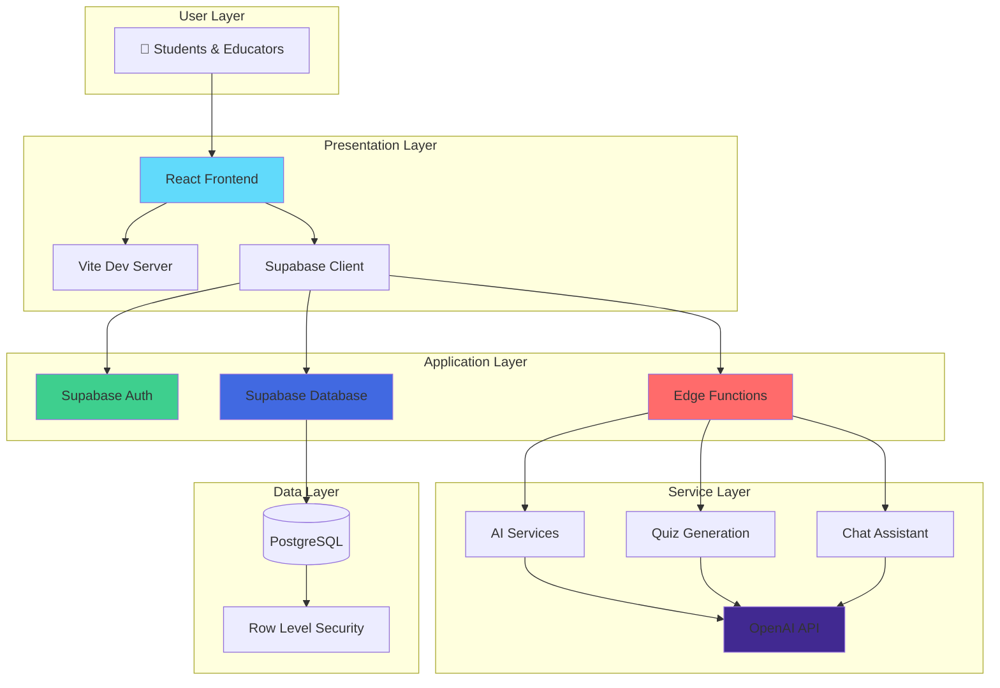

### Component Architecture

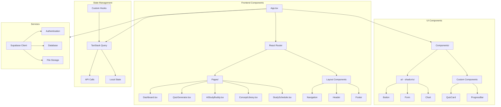

### Data Flow Architecture

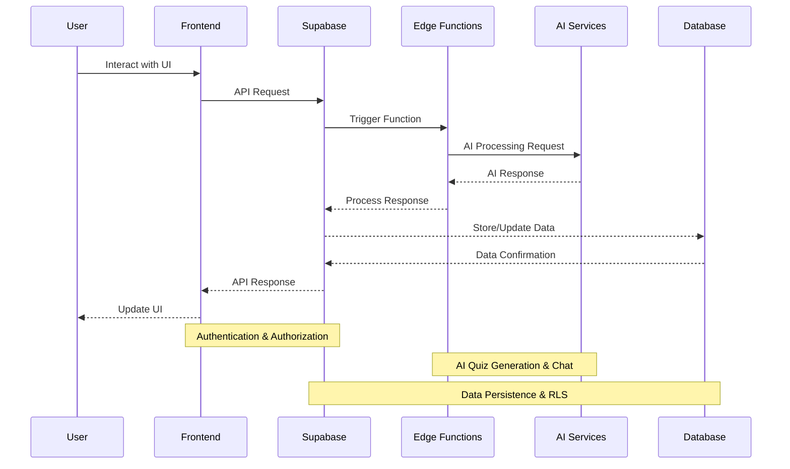

### Deployment Architecture

```mermaid
graph TB
    subgraph "Development"
        Dev[👨‍💻 Developer] --> Git[Git Repository]
        Git --> CI[GitHub Actions]
    end

    subgraph "Build & Test"
        CI --> Test[Run Tests]
        CI --> Lint[ESLint Check]
        CI --> Build[Vite Build]
    end

    subgraph "Staging"
        Build --> Staging[Vercel Preview]
        Staging --> SupabaseStaging[Supabase Staging]
    end

    subgraph "Production"
        Staging --> Prod[Vercel Production]
        Prod --> SupabaseProd[Supabase Production]
        SupabaseProd --> CDN[CDN Distribution]
    end

    subgraph "Monitoring"
        Prod --> Analytics[Analytics]
        Prod --> Logs[Error Logging]
        Prod --> Alerts[Performance Alerts]
    end

    style Prod fill:#10B981
    style SupabaseProd fill:#3ECF8E
    style CDN fill:#F59E0B
```

### Database Schema

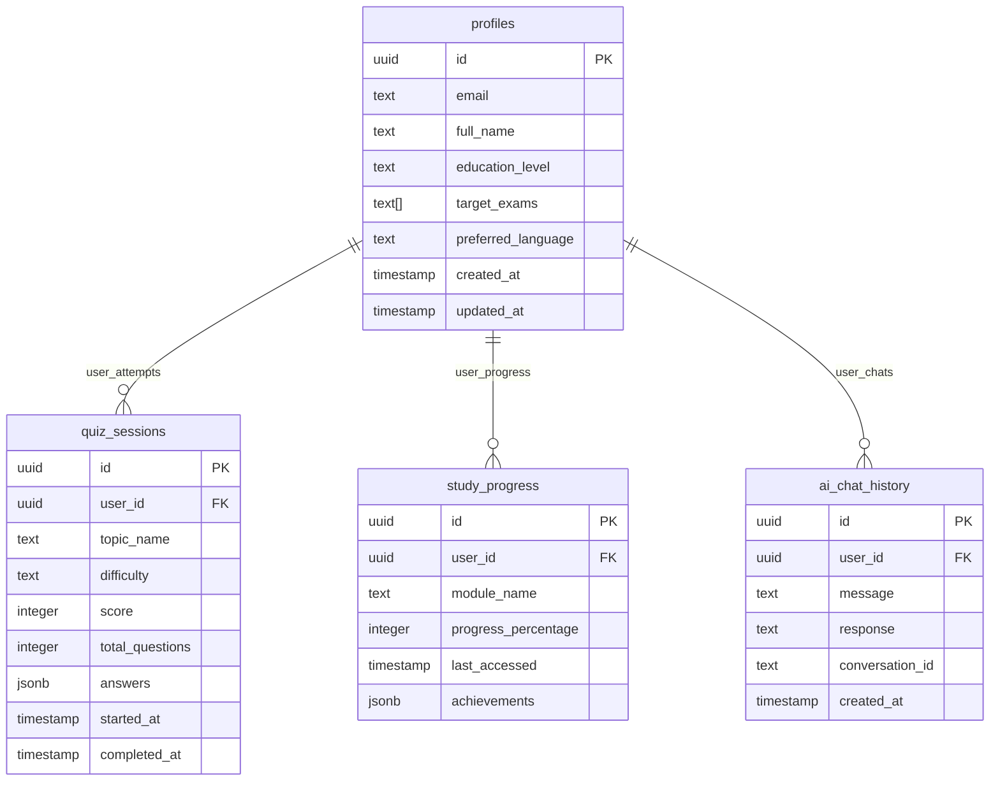

### System Components

<div align="center">

| Layer | Technology | Purpose |
|-------|------------|---------|
| **🎨 Presentation** | React 18 + TypeScript + Vite | Modern, type-safe frontend with fast builds |
| **🎯 UI Framework** | shadcn/ui + Tailwind CSS | Consistent, accessible component system |
| **📊 State Management** | TanStack Query + React Hooks | Efficient server state and local state handling |
| **🔐 Authentication** | Supabase Auth | Secure user management with JWT |
| **💾 Database** | PostgreSQL + RLS | Structured data with row-level security |
| **⚡ Edge Functions** | Supabase Edge Functions | Serverless API endpoints |
| **🤖 AI Services** | OpenAI API | Intelligent quiz generation and chat |
| **📈 Analytics** | Custom Analytics | User progress and performance tracking |

</div>

### Security Architecture

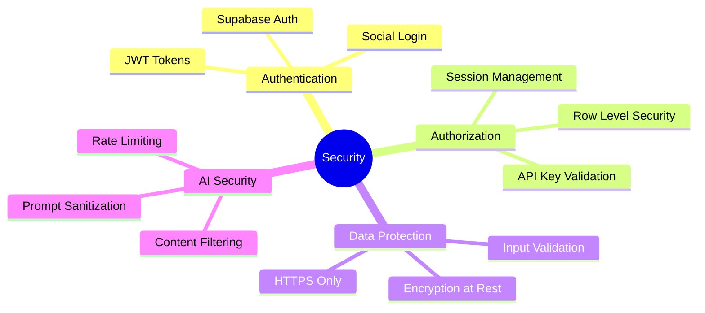

---

---

## 📁 Project Structure

```
prep-iq-agent/
├── 📁 public/                    # Static assets and favicons
│   ├── robots.txt
│   └── favicon.ico
├── 📁 src/
│   ├── 📁 components/           # Reusable UI components
│   │   ├── 📁 ui/              # shadcn/ui component library
│   │   ├── NavLink.tsx         # Navigation components
│   │   └── PageTransition.tsx  # Route transition effects
│   ├── 📁 pages/               # Page-level components
│   │   ├── Dashboard.tsx       # Main dashboard
│   │   ├── QuizGenerator.tsx   # Quiz creation interface
│   │   └── AIStudyBuddy.tsx    # AI chat interface
│   ├── 📁 hooks/               # Custom React hooks
│   │   ├── use-mobile.tsx      # Mobile detection
│   │   └── use-scroll-animation.tsx
│   ├── 📁 lib/                 # Utility functions
│   │   └── utils.ts            # Helper functions
│   ├── 📁 data/                # Static data and configurations
│   │   ├── quiz-data.json      # Quiz topics and subjects
│   │   └── modules.json        # Learning modules
│   ├── 📁 integrations/        # External service integrations
│   │   └── 📁 supabase/        # Supabase client and types
│   ├── App.tsx                 # Main app component
│   ├── main.tsx                # App entry point
│   └── vite-env.d.ts           # Vite type definitions
├── 📁 supabase/                # Backend configuration
│   ├── 📁 functions/           # Edge functions
│   │   ├── 📁 chat-ai/         # AI chat function
│   │   └── 📁 generate-quiz/   # Quiz generation function
│   ├── 📁 migrations/          # Database schema migrations
│   └── config.toml             # Supabase project config
├── 📁 docs/                    # Documentation
├── 📄 package.json             # Dependencies and scripts
├── 📄 vite.config.ts           # Vite configuration
├── 📄 tailwind.config.ts       # Tailwind CSS config
├── 📄 eslint.config.js         # ESLint configuration
└── 📄 README.md                # Project documentation
```

---

## ⚡ Installation

### Detailed Setup Guide

#### 1. Clone and Install

```bash
# Clone the repository
git clone https://github.com/yourusername/prep-iq-agent.git
cd prep-iq-agent

# Install dependencies
npm install
# or
yarn install
```

#### 2. Environment Setup

Create a `.env.local` file in the root directory:

```env
# Supabase Configuration
VITE_SUPABASE_URL=https://your-project.supabase.co
VITE_SUPABASE_PUBLISHABLE_KEY=your-supabase-anon-key

# AI Service Configuration
LOVABLE_API_KEY=your-openai-api-key

# Optional: Analytics and Monitoring
VITE_GA_TRACKING_ID=your-google-analytics-id
```

#### 3. Supabase Setup

```bash
# Install Supabase CLI
npm install -g supabase

# Login to Supabase
supabase login

# Link to your project
supabase link --project-ref your-project-ref

# Push database migrations
supabase db push

# Deploy edge functions
supabase functions deploy
```

#### 4. Development

```bash
# Start development server
npm run dev

# Build for production
npm run build

# Preview production build
npm run preview

# Run linting
npm run lint
```

---

## 🔧 Configuration

### Environment Variables

| Variable | Description | Required | Default |
|----------|-------------|----------|---------|
| `VITE_SUPABASE_URL` | Supabase project URL | ✅ | - |
| `VITE_SUPABASE_PUBLISHABLE_KEY` | Supabase anonymous key | ✅ | - |
| `LOVABLE_API_KEY` | OpenAI API key for AI features | ✅ | - |
| `VITE_GA_TRACKING_ID` | Google Analytics tracking ID | ❌ | - |
| `VITE_APP_ENV` | Application environment | ❌ | `development` |

### Supabase Configuration

1. **Create a new Supabase project**
2. **Enable authentication providers** (Email, Google, etc.)
3. **Configure database tables** using the provided migrations
4. **Set up Row Level Security** policies
5. **Deploy edge functions** for AI capabilities

---

## 📖 Usage

### User Journey Map

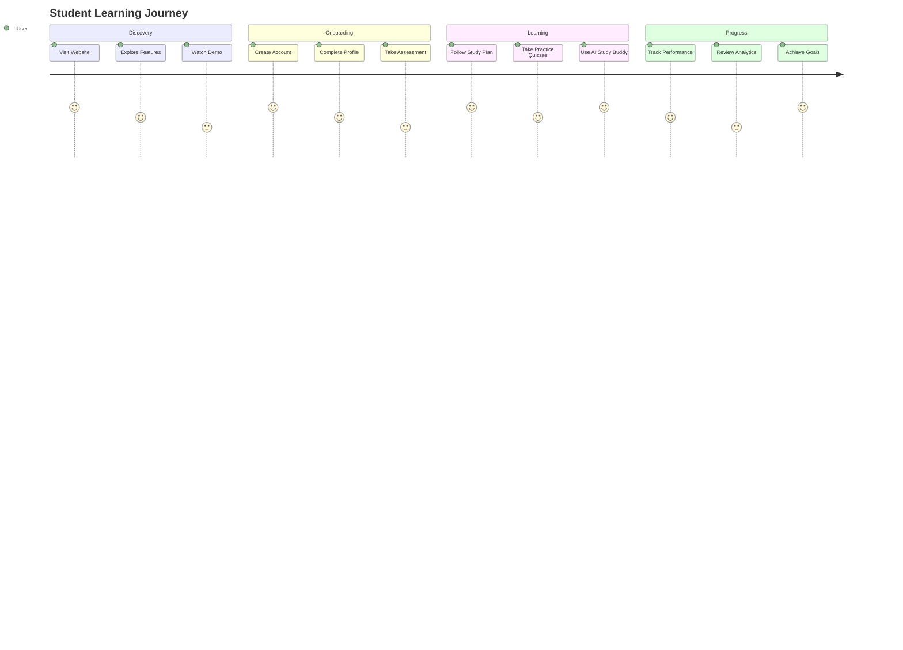

### Student Workflow

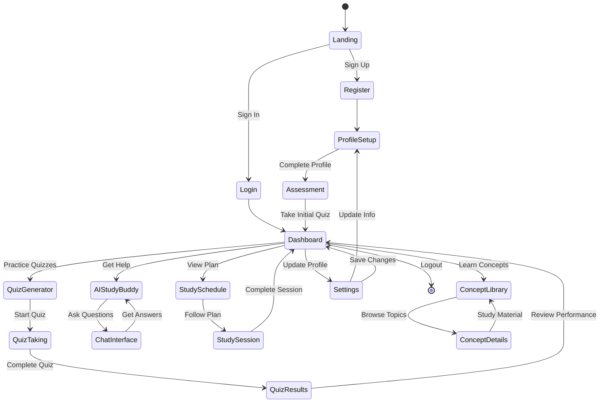

### Quiz Taking Process

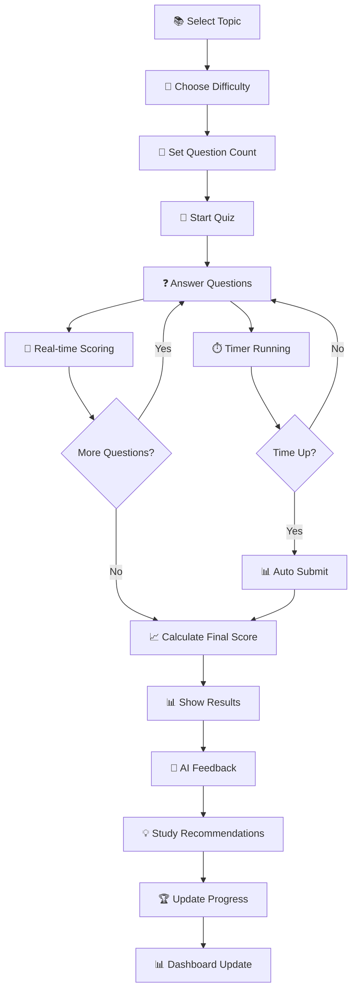

### AI Study Buddy Interaction Flow

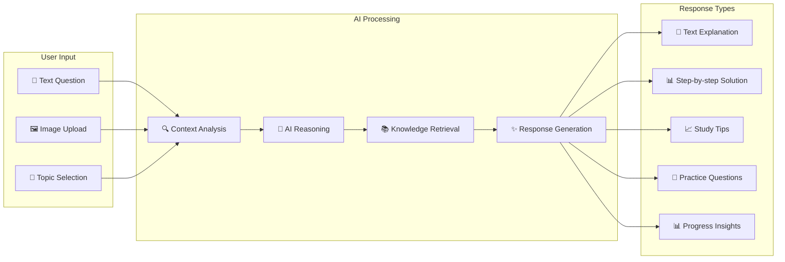

### Study Schedule Management

```mermaid
gantt
    title Study Schedule Example
    dateFormat  YYYY-MM-DD
    section Week 1
    Complete Profile     :done, profile, 2024-01-01, 2024-01-01
    Initial Assessment   :done, assess, 2024-01-02, 2024-01-02
    Basic Algebra        :done, algebra, 2024-01-03, 2024-01-05
    section Week 2
    Logical Reasoning    :active, logic, 2024-01-06, 2024-01-10
    Pattern Recognition  :planned, pattern, 2024-01-11, 2024-01-15
    section Week 3
    Advanced Topics      :planned, advanced, 2024-01-16, 2024-01-20
    Practice Tests       :planned, practice, 2024-01-21, 2024-01-25
    Final Review         :planned, review, 2024-01-26, 2024-01-30
```

### Performance Analytics Flow

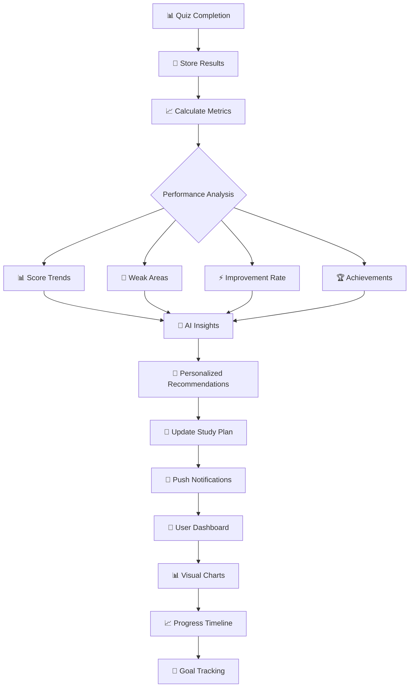

### For Students

<div align="center">

#### 🚀 Getting Started
1. **📝 Create Account**: Sign up with email or social login
2. **👤 Complete Profile**: Set learning goals and target exams
3. **📋 Take Assessment**: Initial quiz to determine skill level
4. **📚 Follow Study Plan**: AI-generated personalized schedule

#### 📖 Daily Learning
5. **🎯 Practice Quizzes**: Regular adaptive quizzes with instant feedback
6. **🤖 AI Assistance**: Get help from AI study buddy anytime
7. **📊 Track Progress**: Monitor improvement with detailed analytics
8. **🏆 Achieve Goals**: Unlock achievements and celebrate milestones

</div>

### For Educators

<div align="center">

#### 👨‍🏫 Administrative Features
1. **🎛️ Access Admin Panel**: Special educator dashboard interface
2. **📝 Create Custom Quizzes**: Design quizzes tailored to curriculum
3. **👥 Monitor Student Progress**: Track individual and class performance
4. **📊 Generate Reports**: Comprehensive analytics and insights

#### 🤖 AI-Powered Teaching
5. **🧠 AI Insights**: Get recommendations for student improvement
6. **📈 Performance Analytics**: Identify trends and learning patterns
7. **🎯 Personalized Learning**: Adaptive content based on student needs
8. **📚 Curriculum Alignment**: Ensure content matches educational standards

</div>

---

---

## 🔌 API Reference

### API Architecture Overview

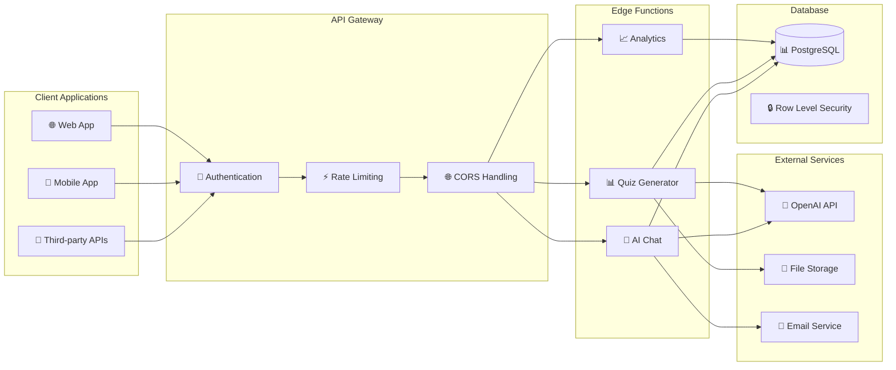

### Supabase Edge Functions

#### Generate Quiz
```http
POST /functions/v1/generate-quiz
Content-Type: application/json
Authorization: Bearer <token>

{
  "topicName": "Logical Reasoning",
  "topicDescription": "Practice logical thinking patterns",
  "difficulty": "medium",
  "questionCount": 15,
  "isMixed": false
}
```

**Response:**
```json
{
  "success": true,
  "quiz": {
    "id": "quiz_123",
    "topic": "Logical Reasoning",
    "difficulty": "medium",
    "questions": [
      {
        "id": "q1",
        "question": "Which of the following is a logical fallacy?",
        "options": ["A", "B", "C", "D"],
        "correctAnswer": "A",
        "explanation": "This is an example of..."
      }
    ]
  }
}
```

#### AI Chat
```http
POST /functions/v1/chat-ai
Content-Type: application/json
Authorization: Bearer <token>

{
  "messages": [
    {
      "role": "user",
      "content": "Explain logical fallacies",
      "image": null
    }
  ]
}
```

**Response:**
```json
{
  "success": true,
  "response": {
    "message": "A logical fallacy is an error in reasoning...",
    "suggestions": ["Practice question 1", "Practice question 2"],
    "relatedTopics": ["Critical Thinking", "Argument Analysis"]
  }
}
```

### Database Schema

#### Profiles Table
```sql
CREATE TABLE profiles (
  id UUID PRIMARY KEY REFERENCES auth.users(id),
  email TEXT,
  full_name TEXT,
  education_level TEXT,
  target_exams TEXT[],
  preferred_language TEXT,
  created_at TIMESTAMPTZ DEFAULT NOW(),
  updated_at TIMESTAMPTZ DEFAULT NOW()
);
```

---

## 🚀 Deployment

### CI/CD Pipeline

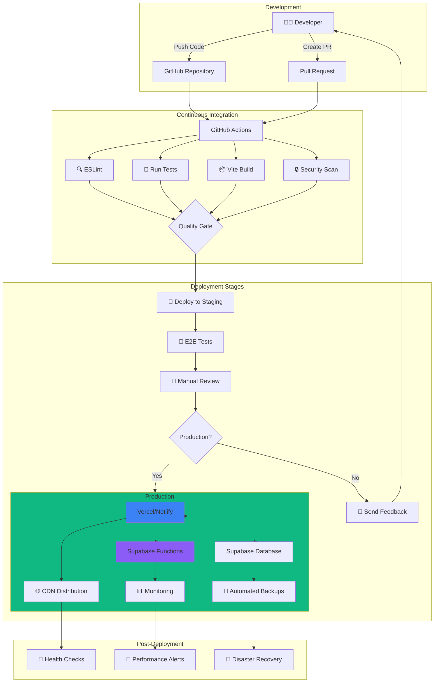

### Deployment Strategies

<div align="center">

| Strategy | Use Case | Pros | Cons |
|----------|----------|------|------|
| **Blue-Green** | Zero-downtime updates | Instant rollback, no downtime | Higher resource usage |
| **Canary** | Gradual rollouts | Risk mitigation, A/B testing | Complex monitoring |
| **Rolling** | Resource-constrained | Efficient resource use | Potential inconsistencies |

</div>

### Frontend Deployment

#### Vercel (Recommended)
```bash
# Install Vercel CLI
npm i -g vercel

# Login to Vercel
vercel login

# Deploy to production
vercel --prod

# Or link existing project
vercel link
```

#### Netlify
```bash
# Install Netlify CLI
npm install -g netlify-cli

# Login to Netlify
netlify login

# Build and deploy
npm run build
netlify deploy --prod --dir=dist
```

### Backend Deployment

#### Supabase
```bash
# Deploy all functions
supabase functions deploy

# Deploy specific function
supabase functions deploy chat-ai

# Push database migrations
supabase db push

# View function logs
supabase functions logs chat-ai
```

### Infrastructure as Code

#### Environment Setup
```bash
# Using Supabase CLI for infrastructure
supabase init
supabase start  # For local development
supabase stop   # Stop local instance
```

### Production Checklist

<div align="center">

#### 🔧 Pre-Deployment
- [ ] Environment variables configured securely
- [ ] SSL certificates enabled and valid
- [ ] Database migrations tested in staging
- [ ] API endpoints tested with Postman/Insomnia
- [ ] Performance benchmarks met

#### 🚀 Deployment
- [ ] CI/CD pipeline passes all checks
- [ ] Database backups created
- [ ] Rollback plan documented
- [ ] Monitoring and alerting configured
- [ ] CDN configured for static assets

#### ✅ Post-Deployment
- [ ] Health checks passing
- [ ] Error monitoring active
- [ ] Performance monitoring enabled
- [ ] User acceptance testing completed
- [ ] Documentation updated

</div>
- [ ] Database backups scheduled
- [ ] Monitoring and logging set up
- [ ] CDN configured for assets
- [ ] Performance optimization applied

---

## 🤝 Contributing

We love your input! We want to make contributing to Prep IQ Agent as easy and transparent as possible.

### Development Process

1. **Fork** the repo on GitHub
2. **Clone** the project to your local machine
3. **Create** a new branch: `git checkout -b feature/amazing-feature`
4. **Make** your changes and test thoroughly
5. **Commit** your changes: `git commit -m 'Add amazing feature'`
6. **Push** to the branch: `git push origin feature/amazing-feature`
7. **Open** a Pull Request

### Guidelines

#### Code Style
- Follow the existing code style
- Use TypeScript for all new code
- Write meaningful commit messages
- Add tests for new features

#### Pull Request Process
- Update the README if needed
- Update documentation for API changes
- Ensure all tests pass
- Get approval from maintainers

#### Reporting Issues
- Use the issue templates
- Provide detailed reproduction steps
- Include environment information
- Add screenshots for UI issues

### Contributors

<a href="https://github.com/yourusername/prep-iq-agent/graphs/contributors">
  
</a>

---

## 📜 License

This project is licensed under the MIT License - see the [LICENSE](LICENSE) file for details.

```
MIT License

Copyright (c) 2024 Prep IQ Agent

Permission is hereby granted, free of charge, to any person obtaining a copy
of this software and associated documentation files (the "Software"), to deal
in the Software without restriction, including without limitation the rights
to use, copy, modify, merge, publish, distribute, sublicense, and/or sell
copies of the Software, and to permit persons to whom the Software is
furnished to do so, subject to the following conditions:

The above copyright notice and this permission notice shall be included in all
copies or substantial portions of the Software.
```

---

## 🙏 Acknowledgments

### Core Technologies
- **React** - The library for web and native user interfaces
- **Supabase** - The open source Firebase alternative
- **Vite** - Next generation frontend tooling
- **Tailwind CSS** - A utility-first CSS framework
- **shadcn/ui** - Beautifully designed components

### Inspiration
- Educational platforms that prioritize accessibility
- AI-powered learning tools that make education engaging
- Open-source communities that foster innovation

### Special Thanks
- Our amazing contributors and early adopters
- The Supabase and React communities
- Everyone who believes in democratizing education

---

## 📞 Support

### Getting Help

- 📧 **Email**: support@prep-iq-agent.com
- 💬 **Discord**: [Join our community](https://discord.gg/prep-iq-agent)
- 🐛 **Issues**: [GitHub Issues](https://github.com/yourusername/prep-iq-agent/issues)
- 📖 **Documentation**: [Official Docs](https://docs.prep-iq-agent.com)

### Community

- 🌟 **Star** this repo if you find it helpful!
- 🔄 **Fork** and contribute back
- 📢 **Share** with fellow learners
- 💝 **Sponsor** the project development

---

<div align="center">

**Made with ❤️ for smarter learning**

[⬆️ Back to Top](#-prep-iq-agent)

</div>
- Edit files directly within the Codespace and commit and push your changes once you're done.

## What technologies are used for this project?

This project is built with:

- Vite
- TypeScript
- React
- shadcn-ui
- Tailwind CSS

## How can I deploy this project?

Simply open [Lovable](https://lovable.dev/projects/a991ee2c-d840-47dc-bcbe-1f3fa709dfed) and click on Share -> Publish.

## Can I connect a custom domain to my Lovable project?

Yes, you can!

To connect a domain, navigate to Project > Settings > Domains and click Connect Domain.

Read more here: [Setting up a custom domain](https://docs.lovable.dev/features/custom-domain#custom-domain)
